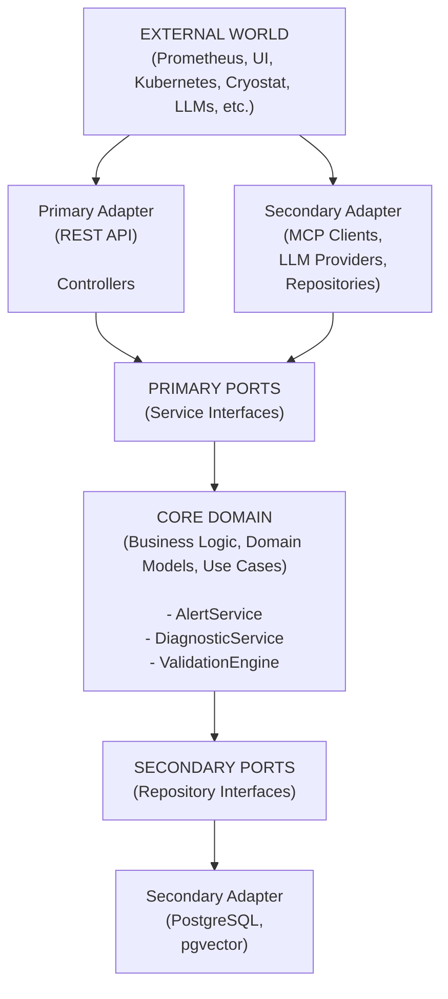

# Causa Backend - Scaffolding Architecture Proposal

- **Document Type:** Architecture Decision Record (ADR)  
- **Status:** Proposed  
- **Last Updated:** 2026-06-03  
- **Author:** Shekhar Saxena
- **Version:** 1.0

---

## Table of Contents

1. [Executive Summary](#executive-summary)
2. [Architecture Decision](#architecture-decision)
3. [Architectural Style: Hexagonal Architecture](#architectural-style-hexagonal-architecture)
4. [Module Overview](#module-overview)
5. [Project Structure](#project-structure-high-level) 
6. [Detailed Module Breakdown](#detailed-module-breakdown) 
7. [Supporting Directories](#supporting-directories)
8. [Conclusion](#conclusion)

---

## Executive Summary

This document outlines the architectural approach for the **Causa Backend** - an intelligent diagnostic tool for Java/Kubernetes memory anomalies. The application is built on **Quarkus** with **LangChain4J** integration, supporting multiple LLM providers (Claude, Ollama, IBM Bob), MCP server connections (Kubernetes, Cryostat, Kruize), and leveraging PostgreSQL with pgvector for vector embeddings.

### Key Architectural Decisions

| Decision | Choice | Rationale |
|----------|--------|-----------|
| **Architectural Style** | Hexagonal Architecture (Ports & Adapters) | Maximum testability, framework independence, clear boundaries |
| **Persistence** | PostgreSQL + pgvector + Flyway | ACID compliance, vector search, versioned migrations |
| **Configuration** | Centralized Config Service + DB + K8s Secrets | Single source of truth, runtime updates, secure credential management |
| **Singleton Scope** | CDI @ApplicationScoped for DB pools, clients | Resource optimization, connection pooling, lifecycle management |
| **Constants Management** | Layered constant classes by domain | Type safety, maintainability, IDE auto-completion |
| **Caching** (Planned) | Multi-layer | Performance optimization, distributed cache support |
| **Security** | Dedicated Security Module + K8s Secrets | Defense in depth, centralized auth/authz strategies, secure credential injection |

---

## Architecture Decision

### Context

Causa requires:
- Integration with **multiple external systems** (MCP servers, LLM providers, notification channels)
- **High configurability** without code changes
- **Testability** at all layers
- **Scalability** for production workloads
- **Security** for handling sensitive credentials and telemetry data
- **Extensibility** for adding new LLM providers or MCP servers

### Decision

We adopt **Hexagonal Architecture** (also known as Ports and Adapters) to achieve:

1. **Domain-Centric Design:** Business logic (core) is independent of infrastructure concerns
2. **Pluggable Adapters:** Easy to swap implementations (e.g., switching from Claude to Ollama)
3. **Testability:** Core logic testable without external dependencies
4. **Clear Boundaries:** Explicit contracts between layers via interfaces (ports)
5. **Framework Independence:** Core domain doesn't depend on Quarkus, JAX-RS, or persistence frameworks

---

## Architectural Style: Hexagonal Architecture

### Core Principles



### Benefits for Causa

1. **LLM Provider Switching:** Change from Claude → Ollama by swapping adapter implementation
2. **MCP Extensibility:** Add new MCP servers without touching core logic
3. **Testing:** Mock all external dependencies cleanly
4. **Deployment Flexibility:** Run with different infrastructure (local, K8s, cloud)

---


## Module Overview

> **💡 Note:** ALL MODULES AND FILE NAMES ARE BASED ON PLANNING PHASE. ACTUAL NAMES or MODULES CAN BE UPDATED AS PER FINAL IMPLEMENTATION PLAN.

The application is organized into **10 core modules** following Hexagonal Architecture:

| Module | Purpose | Layer | 
|--------|---------|-------|
| 📁 **`api/`** | REST API endpoints, DTOs, validators | Primary Adapter | 
| 📁 **`core/`** | Business logic, domain models, ports | Core Domain | 
| 📁 **`infrastructure/`** | Database, caching, persistence | Secondary Adapter | 
| 📁 **`llm/`** | LangChain4J orchestration, providers | Secondary Adapter | 
| 📁 **`mcp/`** | MCP server clients (K8s, Cryostat, Kruize) | Secondary Adapter |
| 📁 **`validation/`** | Hybrid validation engine | Business Logic | 
| 📁 **`rag/`** | RAG pipeline, chunking, retrieval | Business Logic |
| 📁 **`notification/`** | Multi-channel notifications | Secondary Adapter | 
| 📁 **`config/`** | Configuration management | Infrastructure | 
| 📁 **`security/`** | Authentication, authorization, secrets | Infrastructure | 
| 📁 **`common/`** | Constants, utilities, exceptions | Shared |

---

## Project Structure (High-Level)

<details>
<summary><b>📂 Click to expand full project tree</b></summary>

```
causa-backend/
├── docs/                        # 📚 Documentation
├── src/main/java/com/causa/     # ☕ Source code
│   ├── api/                     # 🌐 REST API Layer
│   ├── core/                    # 🎯 Core Domain
│   ├── infrastructure/          # 🔧 Infrastructure
│   ├── llm/                     # 🤖 LLM Integration
│   ├── mcp/                     # 🔌 MCP Integration
│   ├── validation/              # ✅ Validation Engine
│   ├── rag/                     # 📊 RAG Pipeline
│   ├── notification/            # 📢 Notifications
│   ├── config/                  # ⚙️ Configuration
│   ├── security/                # 🔒 Security
│   └── common/                  # 🛠️ Utilities
├── src/main/resources/
│   ├── db/migration/            # 🗄️ Flyway migrations
│   └── prompts/                 # Prompt templates
├── deployment/                  # 🚢 K8s/Helm
├── scripts/                     # 🔨 Utility scripts
└── pom.xml
```

</details>

---

## Detailed Module Breakdown

<details>
<summary><b>📁 Module 1: <code>api/</code> - REST API Layer</b></summary>

<br/>

**Purpose:** Entry point for HTTP requests. Translates REST to domain operations.

**Architecture Layer:** Primary Adapter (Inbound)

**Why Separate?**
- Framework independence (core doesn't know about JAX-RS)
- Can add gRPC/GraphQL adapters later
- API versioning without core changes

```
api/
├── controllers/                 # JAX-RS REST endpoints
│   ├── AlertWebhookController.java      # POST /api/v1/webhooks/alerts
│   ├── DiagnosticController.java        # GET /api/v1/diagnostics/{id}
│   ├── RecommendationController.java    # GET /api/v1/recommendations
│   ├── SettingsController.java          # GET/PUT /api/v1/settings
│   ├── StatsController.java             # GET /api/v1/stats
│   ├── HealthController.java            # GET /api/v1/healthz
│   ├── NotificationController.java      # POST /api/v1/notifications
│   └── ChatController.java              # POST /api/v1/chat
│
├── dto/
│   ├── request/                 # Inbound DTOs
│   │   ├── AlertWebhookRequest.java     # Prometheus alert payload
│   │   ├── RetriggerAnalysisRequest.java
│   │   ├── FeedbackRequest.java
│   │   └── SettingsUpdateRequest.java
│   └── response/                # Outbound DTOs
│       ├── AlertResponse.java
│       ├── DiagnosticResponse.java
│       ├── RecommendationResponse.java
│       ├── HealthResponse.java
│       ├── StatsResponse.java
│       └── ErrorResponse.java
│
├── mappers/                     # DTO ↔ Domain conversion
│   ├── AlertMapper.java
│   ├── DiagnosticMapper.java
│   └── RecommendationMapper.java
│
├── validators/                  # Request validation
│   ├── AlertWebhookValidator.java
│   └── SettingsValidator.java
│
└── filters/                     # JAX-RS filters
    ├── AuthenticationFilter.java        # JWT/API key validation
    ├── CorsFilter.java
    └── RequestLoggingFilter.java
```

</details>

---

<details>
<summary><b>📁 Module 2: <code>core/</code> - Core Domain</b></summary>

<br/>

**Purpose:** Business logic, domain models, use cases. Framework-agnostic.

**Architecture Layer:** Core Domain (Hexagonal Center)

**Why This Matters?**
- Pure business rules, no framework dependencies
- Testable without infrastructure
- Long-lived (survives framework changes)

```
core/
├── domain/                      # Rich domain models (NOT anemic DTOs)
│   ├── Alert.java               # Alert aggregate root
│   ├── Diagnostic.java          # Diagnostic aggregate root
│   ├── Recommendation.java      # Value object
│   ├── EvidenceAssertion.java   # Value object
│   ├── SystemHealth.java
│   ├── LlmAnalysis.java
│   ├── ValidationResult.java
│   └── enums/
│       ├── AlertSeverity.java   # critical, warning, info
│       ├── AlertStatus.java     # firing, resolved
│       ├── FaultDomain.java     # APP_CODE, K8S_CONFIG, JVM_CONFIG
│       ├── DiagnosticStatus.java
│       ├── ComponentStatus.java
│       ├── LlmProviderType.java # CLAUDE, OLLAMA, BOB
│       └── EvidenceSource.java
│
├── services/                    # PRIMARY PORTS (Use Case interfaces)
│   ├── AlertService.java        # Alert ingestion and management
│   ├── DiagnosticService.java   # Diagnostic orchestration
│   ├── RecommendationService.java
│   ├── NotificationService.java
│   ├── HealthCheckService.java
│   └── SettingsService.java
│
└── ports/                       # SECONDARY PORTS (Dependency contracts)
    ├── repositories/            # Data persistence ports
    │   ├── AlertRepository.java
    │   ├── DiagnosticRepository.java
    │   ├── RecommendationRepository.java
    │   └── SettingsRepository.java
    │
    ├── llm/                     # LLM provider ports
    │   ├── LlmProvider.java     # Interface for all LLM providers
    │   └── ChatMemoryStore.java
    │
    ├── mcp/                     # MCP client ports
    │   ├── McpClient.java
    │   └── McpHealthChecker.java
    │
    └── notification/            # Notification channel ports
        └── NotificationChannel.java
```

```

</details>

---

<details>
<summary><b>📁 Module 3: <code>infrastructure/</code> - Infrastructure Layer</b></summary>

<br/>

**Purpose:** Database, caching, persistence implementations.

**Architecture Layer:** Secondary Adapter (Outbound)

**Singleton Pattern:** DB repositories, CacheManager

```
infrastructure/
├── persistence/
│   ├── entities/                # JPA entities (anemic data models)
│   │   ├── AlertEntity.java
│   │   ├── DiagnosticEntity.java
│   │   ├── RecommendationEntity.java
│   │   ├── SystemHealthEntity.java
│   │   ├── SettingsEntity.java
│   │   └── BaseEntity.java      # Common: id, createdAt, updatedAt
│   │
│   ├── repositories/            # Implements core.ports.repositories
│   │   ├── AlertRepositoryImpl.java         # @ApplicationScoped
│   │   ├── DiagnosticRepositoryImpl.java    # @ApplicationScoped
│   │   ├── RecommendationRepositoryImpl.java
│   │   └── SettingsRepositoryImpl.java
│   │
│   ├── converters/              # JPA attribute converters
│   │   ├── JsonbConverter.java              # JSONB ↔ Java Object
│   │   └── AlertSeverityConverter.java      # Enum ↔ String
│   │
│   └── mappers/                 # Entity ↔ Domain mappers
│       ├── AlertEntityMapper.java
│       └── DiagnosticEntityMapper.java
│
├── vector/                      # pgvector integration
│   ├── entities/
│   │   └── EmbeddingEntity.java
│   ├── repositories/
│   │   └── VectorRepository.java
│   ├── VectorStoreAdapter.java
│   └── EmbeddingService.java
│
└── cache/                       # Caching layer
    ├── CacheManager.java        # @ApplicationScoped (SINGLETON)
    ├── CaffeineCache.java       # L1 local cache
    └── RedisCache.java          # L2 distributed cache (optional)
```

**Why Singleton for Repositories?**
- Share database connection pool
- Resource optimization
- Lifecycle management by CDI

</details>

---

<details>
<summary><b>📁 Module 4: <code>llm/</code> - LLM Integration</b></summary>

<br/>

**Purpose:** LangChain4J orchestration, multiple LLM provider support.

**Architecture Layer:** Secondary Adapter (Outbound)

**Singleton Pattern:** LLM providers (expensive initialization, HTTP client reuse)

```
llm/
├── orchestration/               # LangChain4J pipelines
│   ├── DiagnosticPipeline.java
│   ├── ValidationPipeline.java
│   ├── RagPipeline.java
│   └── ChatPipeline.java
│
├── providers/                   # Implements core.ports.llm.LlmProvider
│   ├── ClaudeProvider.java      # @ApplicationScoped (SINGLETON)
│   ├── OllamaProvider.java      # @ApplicationScoped (SINGLETON)
│   ├── BobProvider.java         # @ApplicationScoped (SINGLETON)
│   ├── AbstractLlmProvider.java # Base class
│   └── factory/
│       └── LlmProviderFactory.java  # Factory pattern
│
├── prompts/                     # Prompt engineering
│   ├── PromptTemplateLoader.java
│   ├── DiagnosticPrompts.java
│   ├── ValidationPrompts.java
│   ├── CriticPrompts.java
│   └── ContextEngineeringPrompts.java
│
├── tools/                       # LangChain4J @Tool annotations for MCP
│   ├── KubernetesMcpTool.java
│   ├── CryostatMcpTool.java
│   └── KruizeMcpTool.java
│
├── parsers/                     # LLM output parsers
│   ├── StructuredOutputParser.java
│   ├── DiagnosticOutputParser.java
│   └── ValidationOutputParser.java
│
└── memory/                      # Chat memory management
    ├── ChatMemoryStoreAdapter.java
    └── ConversationContext.java
```

**Extensibility Example:**
```java
// Adding new LLM provider (e.g., OpenAI)
@ApplicationScoped
public class OpenAiProvider implements LlmProvider {
    @Override
    public boolean supports(String providerName) {
        return "openai".equalsIgnoreCase(providerName);
    }
    
    @Override
    public String generate(String prompt) {
        // OpenAI implementation
    }
}
// Factory automatically picks it up via CDI
```

</details>

---

<details>
<summary><b>📁 Module 5: <code>mcp/</code> - MCP Server Integration</b></summary>

<br/>

**Purpose:** MCP server clients for Kubernetes, Cryostat, Kruize.

**Architecture Layer:** Secondary Adapter (Outbound)

**Singleton Pattern:** MCP clients (connection pooling, circuit breaker state)

```
mcp/
├── clients/                     # Implements core.ports.mcp.McpClient
│   ├── AbstractMcpClient.java   # Base HTTP client with retry/circuit breaker
│   ├── KubernetesMcpClient.java # @ApplicationScoped (SINGLETON)
│   ├── CryostatMcpClient.java   # @ApplicationScoped (SINGLETON)
│   └── KruizeMcpClient.java     # @ApplicationScoped (SINGLETON)
│
├── models/                      # MCP request/response models
│   ├── kubernetes/
│   │   ├── PodContextRequest.java
│   │   ├── PodContextResponse.java
│   │   └── K8sEventModel.java
│   ├── cryostat/
│   │   ├── JfrSummaryRequest.java
│   │   ├── JfrSummaryResponse.java
│   │   └── MemoryProfileModel.java
│   └── kruize/
│       ├── RecommendationRequest.java
│       ├── RecommendationResponse.java
│       ├── K8sResourceModel.java
│       └── JvmTuningModel.java
│
├── health/
│   └── McpHealthCheckerImpl.java
│
└── factory/
    └── McpClientFactory.java
```

</details>

---

<details>
<summary><b>📁 Module 6: <code>validation/</code> - Validation Engine</b></summary>

<br/>

**Purpose:** Hybrid validation (LLM evidence + deterministic rules).

```
validation/
├── HybridValidationEngine.java  # Orchestrates both passes
│
├── rules/                       # Deterministic rule-based validation
│   ├── ValidationRule.java      # Interface
│   ├── OomMismatchRule.java
│   ├── GcThresholdRule.java
│   ├── MemoryUtilizationRule.java
│   └── RuleEngine.java
│
├── evidence/                    # LLM evidence validation
│   ├── EvidenceValidator.java
│   ├── AssertionExtractor.java
│   └── CitationVerifier.java
│
└── critic/                      # LLM-as-judge validation
    ├── CriticEngine.java
    └── CriticScoringModel.java
```

</details>

---

<details>
<summary><b>📁 Module 7: <code>rag/</code> - RAG Pipeline</b></summary>

<br/>

**Purpose:** Retrieval-Augmented Generation for context.

```
rag/
├── chunking/                    # Document chunking strategies
│   ├── ChunkingStrategy.java
│   ├── ContextAwareChunker.java
│   └── TokenLimitChunker.java
│
├── retrieval/                   # Context retrieval
│   ├── ContextRetriever.java
│   ├── SimilaritySearcher.java   # Uses pgvector
│   └── HybridSearcher.java       # Keyword + vector
│
├── ingestion/                   # Data ingestion
│   ├── DataIngester.java
│   ├── MetricsIngester.java
│   ├── LogsIngester.java
│   └── EventsIngester.java
│
└── compression/                 # Context compression for token limits
    ├── ContextCompressor.java
    └── SummarizationCompressor.java
```

</details>

---

<details>
<summary><b>📁 Module 8: <code>notification/</code> - Notification Integration</b></summary>

<br/>

**Purpose:** Multi-channel notifications (Slack, Jira, Datadog, Concert).

```
notification/
├── channels/                    # Implements core.ports.notification.NotificationChannel
│   ├── SlackNotifier.java       # @ApplicationScoped
│   ├── JiraNotifier.java        # @ApplicationScoped
│   ├── DatadogNotifier.java     # @ApplicationScoped
│   ├── ConcertNotifier.java     # @ApplicationScoped
│   └── AbstractNotifier.java    # Base with retry logic
│
├── formatters/
│   ├── SlackMessageFormatter.java
│   ├── JiraTicketFormatter.java
│   └── MarkdownFormatter.java
│
└── factory/
    └── NotificationChannelFactory.java
```

</details>

---

<details>
<summary><b>📁 Module 9: <code>config/</code> - Configuration Management ⭐</b></summary>

<br/>

**Purpose:** Centralized configuration from multiple sources.

**Singleton Pattern:** `CausaConfigService` (single source of truth)

**Configuration Hierarchy:** K8s Secrets > ConfigMaps > Database > Environment Variables

```
config/
├── CausaConfigService.java      # ⭐ SINGLETON (@ApplicationScoped)
│                                 # Central config orchestrator
│                                 # Aggregates: DB + K8s Secrets + ConfigMaps + Env
│
├── DatabaseConfig.java
├── LlmConfig.java
├── McpConfig.java
├── AlertConfig.java
├── SecurityConfig.java
├── CacheConfig.java
│
├── properties/                  # ConfigMapping POJOs
│   ├── LlmProperties.java       # Maps LLM_* environment variables
│   ├── McpProperties.java       # Maps MCP_* environment variables
│   ├── AlertProperties.java
│   ├── DatabaseProperties.java
│   └── CacheProperties.java
│
├── loaders/                     # Config source loaders
│   ├── DatabaseConfigLoader.java    # Loads from causa_configs table
│   ├── K8sSecretLoader.java         # Loads from K8s secrets
│   ├── K8sConfigMapLoader.java      # Loads from ConfigMaps
│   └── EnvironmentConfigLoader.java # Loads from env vars
│
└── validators/
    ├── LlmConfigValidator.java
    └── McpConfigValidator.java
```


</details>

---

<details>
<summary><b>📁 Module 10: <code>security/</code> - Security Module ⭐</b></summary>

<br/>

**Purpose:** Authentication, authorization, secrets management.

**Singleton Pattern:** `SecretManager` (caches decrypted secrets)

```
security/
├── authentication/
│   ├── AuthenticationService.java
│   ├── JwtAuthenticator.java
│   ├── ApiKeyAuthenticator.java
│   └── MtlsAuthenticator.java
│
├── authorization/
│   ├── AuthorizationService.java
│   └── RbacPolicy.java
│
├── secrets/
│   ├── SecretManager.java       # ⭐ SINGLETON (@ApplicationScoped)
│   │                            # Loads from K8s secrets, Vault
│   │                            # Caches decrypted values
│   │                            # NEVER logs secret values
│   ├── K8sSecretProvider.java
│   ├── VaultSecretProvider.java # Optional
│   └── EncryptionService.java
│
└── audit/
    ├── AuditLogger.java
    └── AuditEvent.java
```


</details>

---

<details>
<summary><b>📁 Module 11: <code>common/</code> - Utilities & Constants</b></summary>

<br/>

**Purpose:** Shared constants, utilities, exceptions.

**NO MAGIC STRINGS POLICY:** All literals must be named constants.

```
common/
├── constants/                   # All application constants
│   ├── ApiConstants.java        # API paths, headers, media types
│   ├── ErrorConstants.java      # Error codes, messages
│   ├── ConfigConstants.java     # Configuration keys
│   ├── DatabaseConstants.java   # Table/column names
│   ├── LlmConstants.java        # LLM defaults
│   ├── McpConstants.java        # MCP identifiers
│   └── ValidationConstants.java # Thresholds, rules
│
├── utils/                       # Utility classes (final + private constructor)
│   ├── JsonUtils.java           # JSON serialization/deserialization
│   ├── DateTimeUtils.java       # ISO formatting, parsing
│   ├── MetricsUtils.java
│   ├── StringUtils.java
│   ├── ValidationUtils.java
│   └── RetryUtils.java
│
└── exceptions/                  # Custom exception hierarchy
    ├── CausaException.java      # Base checked exception
    ├── CausaRuntimeException.java
    ├── LlmProviderException.java
    ├── McpConnectionException.java
    ├── ValidationException.java
    ├── ConfigurationException.java
    ├── AuthenticationException.java
    └── DataAccessException.java
```

</details>

---

## Supporting Directories

<details>
<summary><b>🗄️ Database Migrations</b></summary>

<br/>

```
src/main/resources/db/migration/
├── V1.0.0__create_alerts_table.sql
├── V1.0.1__create_diagnostics_table.sql
├── V1.0.2__create_recommendations_table.sql
├── V1.0.3__create_system_health_table.sql
├── V1.0.4__create_causa_configs_table.sql
├── V1.0.5__enable_pgvector_extension.sql
├── V1.0.6__create_vector_embeddings_table.sql
├── V1.0.7__create_indexes.sql
└── V1.0.8__seed_default_configs.sql
```

</details>

---

<details>
<summary><b>🚢 Deployment</b></summary>

<br/>

```
deployment/
├── kubernetes/
│   ├── base/                    # Kustomize base
│   └── overlays/                # Environment overlays (dev/staging/prod)
├── helm/                        # Helm charts
└── prometheus/                  # Alert configurations
```

</details>

---

<details>
<summary><b>🔨 Scripts</b></summary>

<br/>

```
scripts/
├── db/
│   ├── init-db.sh
│   └── seed-data.sh
├── local-dev/
│   ├── start-postgres.sh
│   ├── start-ollama.sh
│   ├── setup-mcp-servers.sh
│   └── generate-secrets.sh
└── migration/
    ├── generate-migration.sh
    └── validate-migrations.sh
```

</details>


---

## Conclusion

This architecture provides:

✅ **Scalability:** Horizontal scaling via Kubernetes  
✅ **Testability:** Hexagonal architecture enables comprehensive testing  
✅ **Extensibility:** Add LLM providers, MCP servers, notification channels easily  
✅ **Maintainability:** Clear separation of concerns, constants, utilities  
✅ **Security:** Centralized secrets management, RBAC  
✅ **Performance:** Multi-layer caching, connection pooling, singleton patterns  
✅ **Observability:** Health checks, metrics, audit logging  


---
**End of Document**
