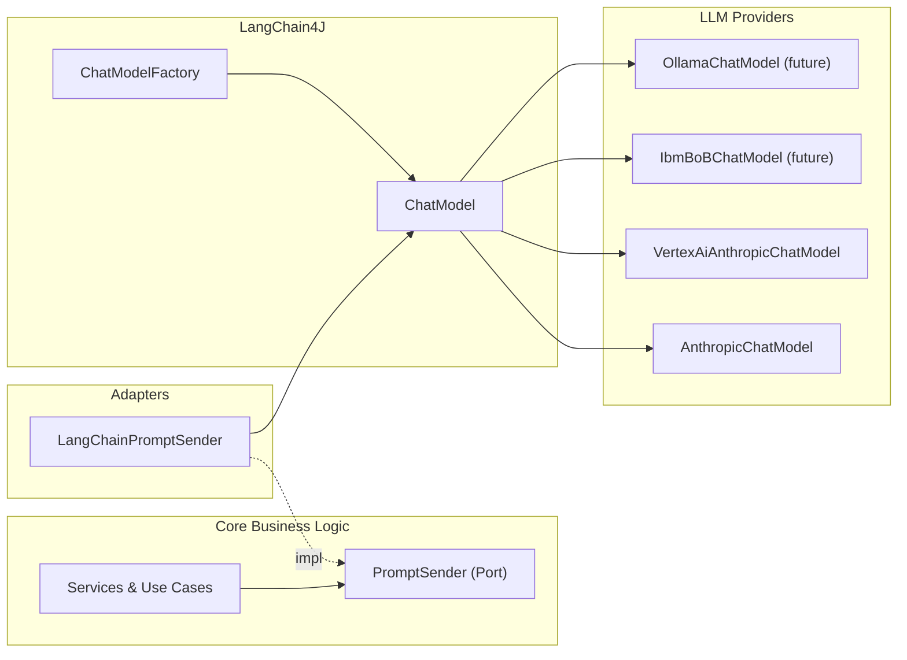
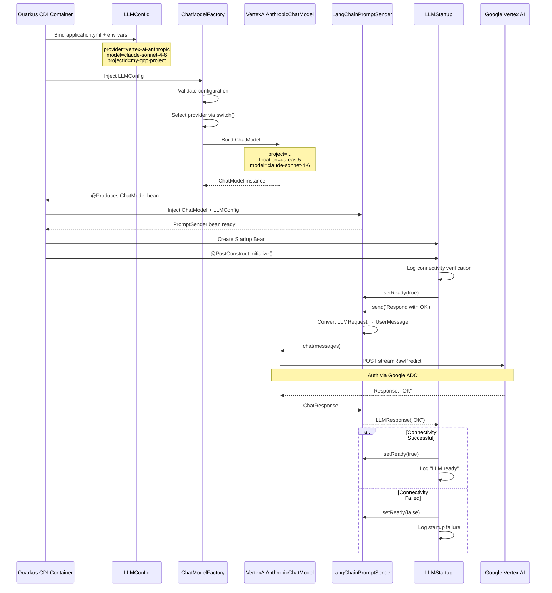
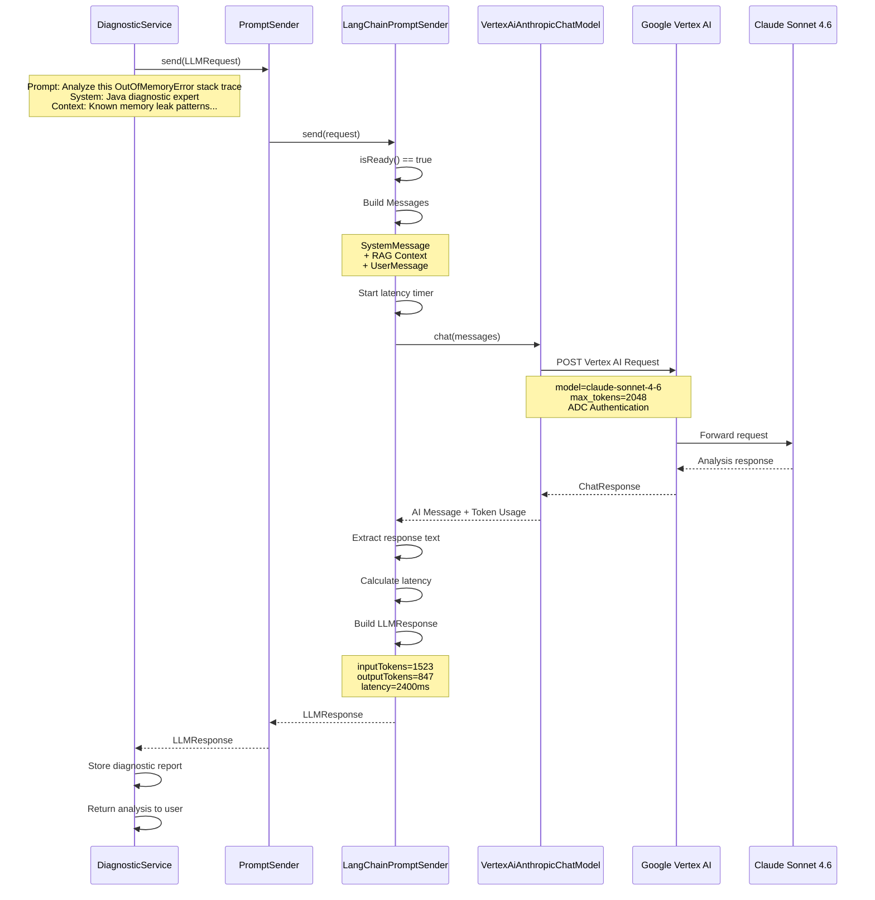

# LLM Module Architecture

## Overview

The LLM module provides a **provider-agnostic abstraction** for integrating Large Language Models into the Causa diagnostic platform. It follows **hexagonal architecture** principles, using **LangChain4J** as the common integration layer across multiple LLM providers.

**Current Status:** ✅ Claude (Anthropic API + Vertex AI) implemented | ✅ IBM BOB Shell (`bob`) implemented | 🚧 IBM Bob REST API, Ollama planned

---

## Architecture Approach

### Design Philosophy

We chose a **single adapter pattern** over multiple provider-specific implementations:

```
PromptSender (interface)
    └── LangChainPromptSender (ONE adapter for ALL providers)
            └── wraps ChatModel (LangChain4J's provider interface)
                    ├── AnthropicChatModel (Claude via direct API)
                    ├── VertexAiAnthropicChatModel (Claude via Vertex AI)
                    ├── IbmBoBChatModel (future)
                    └── OllamaChatModel (future)
```

**Why this approach?**
1. **LangChain4J provides unified abstractions** — `ChatModel` interface works identically across all providers
2. **Single code path** — business logic calls ONE `PromptSender` implementation regardless of provider
3. **MCP tool support** — LangChain4J has built-in Model Context Protocol integration
4. **Extensibility** — adding a new provider = 1 case in factory + 1 dependency
5. **Consistent error handling** — all provider errors normalized to `LLMException`

---

## Component Architecture

### Layer Diagram



---

## Complete Workflow Example: Claude via Vertex AI

### Startup Flow (@Startup)



### Runtime Flow (Business Logic Call)



---

## Libraries and Dependencies

### Core Dependencies

| Library | Version | Purpose | Maven Coordinates |
|---------|---------|---------|-------------------|
| **LangChain4J Core** | 1.15.1 | AI orchestration framework, unified ChatModel interface | `dev.langchain4j:langchain4j:1.15.1` |
| **LangChain4J Anthropic** | 1.15.1 | Direct Anthropic API integration (uses HTTP + API key) | `dev.langchain4j:langchain4j-anthropic:1.15.1` |
| **LangChain4J Vertex AI Anthropic** | 1.15.1-beta25 | Google Cloud Vertex AI integration for Claude (uses Google ADC) | `dev.langchain4j:langchain4j-vertex-ai-anthropic:1.15.1-beta25` |
| **Quarkus SmallRye Config** | 3.36.1 | Type-safe configuration via @ConfigMapping | Built-in to Quarkus platform |
| **Quarkus SmallRye Health** | 3.36.1 | MicroProfile Health checks for readiness probes | Built-in to Quarkus platform |

### Why LangChain4J?

1. **Unified interface** — `ChatModel.chat(messages)` works for all providers
2. **Built-in MCP support** — Model Context Protocol for tool calling
3. **Production features** — Retry logic, timeouts, request/response logging
4. **Community** — Active development, regular updates, enterprise adoption
5. **Java-first** — Idiomatic Java APIs, not a Python port

---

## Configuration

### Environment Variable Sources

Causa Backend reads configuration from **two sources** with strict separation of concerns:

| Source | Contains | Example Variables | Location in Kubernetes |
|--------|----------|-------------------|------------------------|
| **ConfigMap** | Public, non-sensitive settings | `LLM_PROVIDER`, `LLM_MODEL_NAME`, `LLM_TEMPERATURE`, `LLM_MAX_TOKENS`, `VERTEX_LOCATION` | `deployment/kubernetes/base/configmap.yaml` |
| **Secret** | Credentials, API keys, sensitive IDs | `LLM_API_KEY`, `VERTEX_PROJECT_ID` | `deployment/kubernetes/base/secret.yaml` |

**⚠️ Security Rule:** NEVER put `LLM_API_KEY` or `VERTEX_PROJECT_ID` in ConfigMap.

**Configuration Flow:**

```
1. Kubernetes ConfigMap (causa-config)
   ├─> LLM_PROVIDER=vertex-ai-anthropic
   ├─> LLM_MODEL_NAME=claude-sonnet-4-6
   ├─> LLM_TEMPERATURE=0.1
   ├─> LLM_MAX_TOKENS=4096
   └─> VERTEX_LOCATION=us-east5

2. Kubernetes Secret (causa-llm-secrets)
   ├─> LLM_API_KEY=sk-ant-...          (for anthropic provider)
   └─> VERTEX_PROJECT_ID=my-project    (for vertex-ai-anthropic provider)

3. Deployment injects both via envFrom:
   - configMapRef: causa-config
   - secretRef: causa-llm-secrets (optional: true)

4. application.yml reads ${LLM_*} env vars

5. LLMConfig (@ConfigMapping) binds to Java interface

6. ChatModelFactory uses LLMConfig to build ChatModel
```

See [LLM Configuration Options](../llm/llm-config-options.md) for complete configuration reference.


## Health Checks

The `LLMHealthCheck` class implements MicroProfile `@Readiness`:

```
GET /q/health/ready

{
  "status": "UP",
  "checks": [
    {
      "name": "llm",
      "status": "UP",
      "data": {
        "status": "READY",
        "message": "LLM provider is connected and responsive"
      }
    }
  ]
}
```

Kubernetes uses this to decide whether to route traffic to the pod.

**Status logic:**
- `UP` — `LLMStartup` connectivity check succeeded
- `DOWN` — `LLMStartup` connectivity check failed (non-fatal, app still runs)

---

## Future Enhancements

### Planned Providers

| Provider | Library | Authentication |
|----------|---------|----------------|
| IBM Bob REST API (`ibm-bob`) | `langchain4j-open-ai` (OpenAI-compatible) | `LLM_API_KEY` + `LLM_BASE_URL` |
| Ollama (`ollama`) | `langchain4j-ollama` | None (local runtime) |


---

## References

- [LangChain4J Documentation](https://docs.langchain4j.dev/)
- [LangChain4J Anthropic Integration](https://docs.langchain4j.dev/integrations/language-models/anthropic/)
- [Claude on Vertex AI - Anthropic Docs](https://docs.anthropic.com/en/api/claude-on-vertex-ai)
